# Awesome-Application-Networking-Service-To-Service-Connectivity 🔗 🌐 🚀

  

  
  
  
  
  
  

---

## 🌟 Top Application Networking & Service-to-Service Connectivity Ecosystem 📡 🛡️

**Curated Directory of Commercial Service Mesh Platforms, eBPF Data Planes & Open-Source Application Networking Frameworks**  

*Comprehensive guide covering Zero-Trust mTLS, Sidecar & Ambient/Sidecarless Mesh, Multi-Cluster Routing, Microservices API Gateways & Distributed Service Connectivity* ⚡

**Last updated: October 2026** 📅

---

### 📌 Overview & SEO Summary 🔍

Welcome to the definitive curated directory of **application networking platforms**, **service-to-service connectivity frameworks**, **API gateways**, and **open-source service mesh tools**. Modern cloud-native architectures rely on robust, low-latency communication planes between microservices across Kubernetes clusters, hybrid cloud VMs, and serverless environments.

This guide provides deep technical insights, pricing benchmarks, and feature breakdowns for both commercial SaaS offerings (*Amazon VPC Lattice*, *Solo.io Gloo*, *Tetrate Service Express*, *F5 Distributed Cloud*, *HashiCorp Consul*, *Prosimo*) and top open-source projects (*Traefik*, *Kong*, *Istio*, *Consul*, *Envoy*, *Dapr*, *Cilium*, *APISIX*, *Linkerd*, *Meshery*, *Project Contour*, *Kuma*, *Pipy*, *Admiral*, *Bondy*, *NSM*).

---

## 📑 Table of Contents 📖

- [🏢 SaaS & Commercial Platforms](#-saas--commercial-platforms)
- [🔓 Open-Source GitHub Projects](#-open-source-github-projects)
- [🛠️ How to Contribute](#%EF%B8%8F-how-to-contribute)
- [📊 Star History](#-star-history)
- [🤝 Support & Sponsorship](#-support--sponsorship)
- [⚠️ Disclaimer](#%EF%B8%8F-disclaimer)

---

## 🏢 SaaS / Commercial Platforms 💼 ☁️

The global Application Networking and Service Mesh software market is estimated at **$630M–$1.8B in 2026** (projected to reach **$5.7B–$6.3B by 2030–2035** at a ~27% CAGR). The market is **highly fragmented**, split between hyperscale cloud providers (AWS, Google Cloud), enterprise networking giants (Cisco, IBM/F5), and specialized cloud-native service mesh vendors (Solo.io, Tetrate, Buoyant).

The service mesh and application networking market has consolidated around a handful of enterprise platforms built on open-source cores (Istio, Envoy, Cilium), with commercial differentiation focused on multi-cluster governance, AI gateway capabilities, and zero-trust security.

| SaaS / Commercial Platform | Company / Owner | Valuation / Market Cap | Standard Edition Starting Price | Free Tier / Free Trial Limits | Description |
| :--- | :--- | :--- | :--- | :--- | :--- |
| **[Amazon VPC Lattice](https://aws.amazon.com/vpc/lattice/)** ☁️ | Amazon | ~$2.0 Trillion | $0.025/service-hour + $0.025/GB data processed | No permanent free tier; 30-day trial with 730 service-hours & 10GB processing free | **Fully managed application networking** — Connect, secure, and monitor services across VPCs and accounts. Auth policies, service networks, and resource configs. No sidecar required. |
| **[Cilium Service Mesh](https://cilium.io/)** 🐝 | Isovalent (Cisco) | ~$28 Billion (Parent Cisco) | Cilium OSS free; Isovalent Enterprise contact sales | **Cilium OSS free forever**; 30-day enterprise trial available | **eBPF-based sidecarless mesh** — Kernel-level L3/L4 enforcement with optional Envoy for L7. Lowest CPU usage under low load. Used in production at Google, AWS, and Datadog. |
| **[F5 Distributed Cloud App Connect](https://www.f5.com/cloud)** 🔴 | F5 Networks | ~$10 Billion | ~$3,000/month (3-year minimum commitment) | No free tier; 30-day enterprise proof-of-concept trial via sales | **Multi-cloud application networking** — App Connect (service mesh), WAF, API security, DDoS mitigation, and bot defense in a unified SaaS console. |
| **[HashiCorp Consul](https://www.consul.io/)** 🔐 | HashiCorp (IBM) | ~$5 Billion (Acquired by IBM) | $0.027/client-hour (~$20/month per node) on HCP Consul | **Free tier: $500 HCP free credits** valid for 30 days | **Service discovery and mesh** — Identity-based service networking across any runtime. Multi-runtime support (EKS, EC2, ECS, VMs, K8s, bare metal). API gateway included on Premium. |
| **[Solo.io Gloo Network](https://www.solo.io/)** 🎛️ | Solo.io | ~$1.0 Billion | Gloo Gateway Open Source free; Enterprise contact sales | **Free Tier: Gloo Gateway Community Edition free forever** (up to 5 routes/nodes) | **Envoy-based application networking** — Gloo Gateway (API gateway) and Gloo Mesh (Istio-based multi-cluster). AI gateway capabilities added in 2026. |
| **[Prosimo Application Mesh](https://www.prosimo.io/)** 🕸️ | Prosimo | ~$150 Million (Est. VC valuation) | $1,000/month starting base price | No free tier; 14-day hosted trial upon sales registration | **Multi-cloud networking and application mesh** — Simplifies connectivity across AWS, Azure, and GCP. Hidden costs add ~50% to advertised price. |
| **[Tetrate Service Express](https://tetrate.io/)** 🚀 | Tetrate | ~$100 Million (Est. VC valuation) | Agent Router: $0.001/req pay-as-you-go; Enterprise contact sales | **Free plan: $5 free initial credits** for Agent Router Service; 14-day trial for TSE | **Enterprise Istio and Envoy platform** — Tetrate Istio Subscription, Service Bridge (multi-cluster), and Agent Router Service for AI workloads. Available via AWS Marketplace. |
| **[Linkerd (Commercial Support)](https://linkerd.io/)** 🦊 | Buoyant | ~$35 Million (Est. VC valuation) | Linkerd OSS free; Buoyant Enterprise starting at $0.50/workload-hour | **Linkerd OSS free forever** (non-commercial/small clusters); 30-day enterprise trial | **Ultralight service mesh for Kubernetes** — Rust-based micro-proxy with lowest latency in benchmarks. Simplest operational model among major meshes. |
| **[Traefik Hub](https://traefik.io/)** 🚦 | Traefik Labs | ~$25 Million (Est. VC valuation) | Traefik Proxy OSS free; Enterprise contact sales | **30-day free trial** for Traefik Hub API Gateway & Mesh | **Cloud-native API gateway and mesh** — Built on Traefik Proxy (MIT). Native WAF, multi-cluster management, OIDC/JWT auth, and FIPS compliance. |
| **[Istio (Commercial Support)](https://istio.io/)** 🔷 | Google / IBM / Solo.io | N/A (Open Source Core) | Istio OSS free; commercial support pricing via vendors | **Istio OSS free forever** | **The most widely adopted service mesh** — Sidecar-based (Envoy), multi-cluster, mTLS, traffic splitting. Commercial distributions add governance and support. |

---

## 🔓 Open-Source GitHub Projects 🛠️ 🌐

*Sorted by GitHub Stars Count (Descending)* 🌟

- **[Traefik Proxy](https://github.com/traefik/traefik)**   
  **Cloud-native application proxy**, MIT licensed. ~51k+ stars. Supports TCP/UDP/HTTP routing with automatic service discovery. Foundation for Traefik Hub commercial tiers. 🚦

- **[Kong](https://github.com/kong/kong)**   
  **The cloud-native API gateway and service connectivity platform**, Apache-2.0 licensed. ~44k+ stars. High-performance Lua/OpenResty data plane with extensive plugin ecosystem for auth, security, and traffic control. 🦍

- **[Istio](https://github.com/istio/istio)**   
  **The most widely adopted service mesh**, Apache-2.0 licensed. ~37k+ stars. Sidecar-based and Ambient (sidecarless) architecture with Envoy proxy, mTLS, traffic management, observability, and multi-cluster support. Foundational technology behind Tetrate, Solo.io Gloo Mesh, and Google Cloud Service Mesh. 🛡️

- **[Consul](https://github.com/hashicorp/consul)**   
  **Service discovery and mesh**, MPL-2.0 licensed. ~29k+ stars. Multi-runtime support (K8s, VMs, bare metal). Connect (mTLS), intentions, and API gateway. Enterprise adds advanced mesh features and support. 🔐

- **[Envoy Proxy](https://github.com/envoyproxy/envoy)**   
  **Cloud-native high-performance edge/middle/service proxy**, Apache-2.0 licensed. ~26k+ stars. The data plane for Istio, Gloo, and countless service mesh implementations. L4/L7 proxy with dynamic configuration and observability. 🔷

- **[Dapr (Distributed Application Runtime)](https://github.com/dapr/dapr)**   
  **Portable, event-driven runtime for microservices**, Apache-2.0 licensed. ~26k+ stars. Provides service-to-service invocation with built-in mTLS, state management, pub/sub, and distributed tracing. 🎯

- **[Cilium](https://github.com/cilium/cilium)**   
  **eBPF-based networking, security, and observability**, Apache-2.0 licensed. ~21k+ stars. Sidecarless service mesh with kernel-level L3/L4 enforcement and optional Envoy for L7. Lowest CPU usage under low load; eliminates per-pod proxy overhead. 🐝

- **[Apache APISIX](https://github.com/apache/apisix)**   
  **Dynamic, real-time, high-performance API gateway & service mesh data plane**, Apache-2.0 licensed. ~17k+ stars. Built on Nginx and LuaJIT with hot-reloading dynamic routing, traffic splitting, and mTLS support. 🚀

- **[Linkerd](https://github.com/linkerd/linkerd2)**   
  **Ultralight service mesh for Kubernetes**, Apache-2.0 licensed. ~10k+ stars. Rust-based micro-proxy with **lowest response times** — outperforming Cilium by 29.85% and Istio by 63.43% in mTLS benchmarks. Simplest operational model. 🦊

- **[Easegress](https://github.com/easegress-io/easegress)**   
  **All-in-one traffic orchestration system**, Apache-2.0 licensed. ~5.9k+ stars. Offers high availability, service auto-discovery, resilience features (circuit breaking, rate limiting), and microservice routing. 📈

- **[Meshery](https://github.com/meshery/meshery)**   
  **Cloud-native management plane for service meshes**, Apache-2.0 licensed. ~5k+ stars. Adapters for Istio, Linkerd, Kuma, NGINX Service Mesh, and more. Multi-mesh lifecycle management and performance benchmarking. 📊

- **[Project Contour](https://github.com/projectcontour/contour)**   
  **High-performance ingress controller & service router for Kubernetes**, Apache-2.0 licensed. ~4.0k+ stars. Built on Envoy proxy with dynamic xDS configuration, multi-team ingress delegation, and TLS termination. 🛣️

- **[Kuma](https://github.com/kumahq/kuma)**   
  **Universal service mesh by Kong**, Apache-2.0 licensed. ~3.8k+ stars. Supports both Kubernetes and VMs, multi-mesh, and zone-based deployments. Envoy-based data plane with policy management. 🐻

- **[Pipy](https://github.com/flomesh-io/pipy)**   
  **Programmable proxy for cloud, edge, and IoT**, Apache-2.0 licensed. ~3k+ stars. Lightweight, scriptable proxy for building custom service mesh data planes and API gateways. 🔧

- **[Admiral (Istio Ecosystem)](https://github.com/istio-ecosystem/admiral)**   
  **Automatic configuration for multi-cluster Istio**, Apache-2.0 licensed. ~567 stars. Provides automatic configuration generation, syncing, and service discovery for Istio across multiple clusters. 🌍

- **[Gloo Mesh (Solo.io)](https://github.com/solo-io/gloo-mesh)**   
  **Istio-based multi-cluster service mesh management**, Apache-2.0 licensed. ~500+ stars. Adds enterprise governance, RBAC, and unified control plane on top of Istio. Commercial version available. 🎛️

- **[Envoy Control](https://github.com/allegro/envoy-control)**   
  **Platform-agnostic production-ready Envoy control plane**, Apache-2.0 licensed. ~400+ stars. Provides service discovery and dynamic configuration for Envoy-based service meshes without Kubernetes dependency. ⚙️

- **[Bondy](https://github.com/bondy-io/bondy)**   
  **Scalable application networking platform**, Apache-2.0 licensed. ~200+ stars. Combines service mesh and event mesh capabilities. Implements WAMP (Web Application Messaging Protocol) in Erlang. 🔗

- **[Network Service Mesh (NSM)](https://github.com/networkservicemesh/networkservicemesh)**   
  **Service mesh for Kubernetes with network service abstractions**, Apache-2.0 licensed. ~35 stars on main repo, active ecosystem of 20+ sub-repos. Provides complex network topologies for multi-cloud and telco workloads. 🌐

---

## 🛠️ How to Contribute 🤝

Contributions are welcome! Follow these steps to submit new application networking platforms or open-source service mesh software:

1. 🍴 **Fork** the repository.
2. 📝 **Add/edit** entries in `README.md` maintaining table/list structure and formatting.
3. 🔗 Include project title, official website/GitHub link, exact Stars_Count badge, license, and brief description.
4. 🚀 Submit a **Pull Request** with a descriptive summary of your changes.

---

## 📊 Star History 📈

---

## 🤝 Support & Sponsorship 💖

Thank you for visiting and using this application networking directory! If you find this curated list valuable for your team or project, please consider supporting its continued maintenance:

- ⭐ **Star** this repository on GitHub to boost visibility!
- 🔀 **Fork** and share it with your platform engineering & SRE network.
- ☕ **Buy Me a Coffee / Sponsor**: Support open-source curation and research via the [GitHub Sponsor Dashboard](https://github.com/sponsors/ishandutta2007).

---

## ⚠️ Disclaimer ℹ️

- This is a **community-curated** list — not exhaustive and not an endorsement. ℹ️
- Service mesh architectures differ significantly in performance: Linkerd outperforms Istio and Cilium in latency benchmarks, while Cilium with eBPF has lowest CPU under low load. **Benchmark for your specific workload** before committing. 🔒
- Open-source service meshes (Istio, Linkerd, Cilium, Consul) provide self-hosted ownership and community support, but enterprise-grade SLA guarantees, multi-cluster governance, and vendor support remain primarily commercial offerings. 🔗

---

  <b>Made with ❤️ for platform engineers, SREs, and open-source networking developers.</b>

